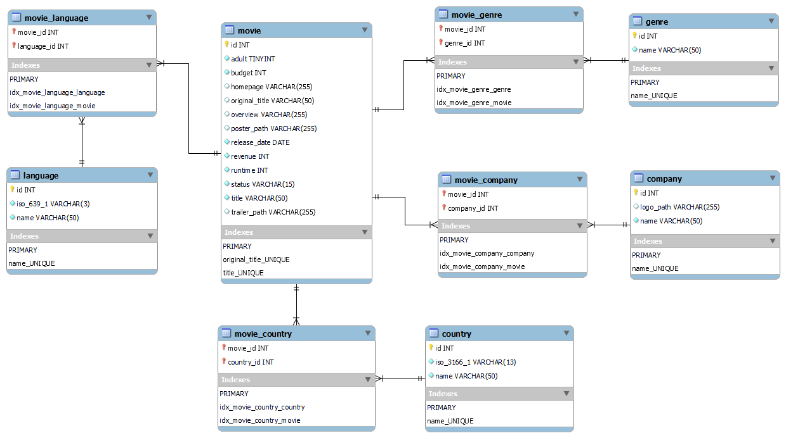
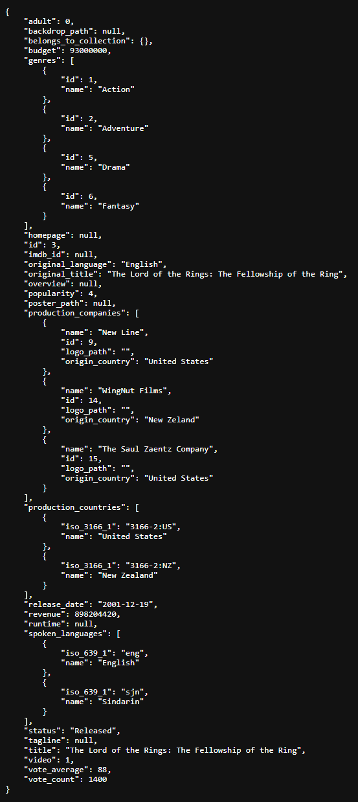

# MovieDb

REST API inspired by [The Movie Database API](https://www.themoviedb.org/documentation/api).

Build a relational database representing the data needed to reproduce a response made from The Movie Database API.
Perform data access through repositories and prepare responses with correct headers to send a JSON object.

Follow PSR-1, PSR-4 and PSR-12 standards.

### Technologies

- PHP 8.2
- Apache 2.4
- MySQL 8.0

### Resources

- REST : https://www.ics.uci.edu/~fielding/pubs/dissertation/rest_arch_style.htm
- Repository pattern : https://martinfowler.com/eaaCatalog/repository.html
- Server configuration : https://cheatsheetseries.owasp.org/cheatsheets/PHP_Configuration_Cheat_Sheet.html
- Response model : https://developers.themoviedb.org/3/movies/get-movie-details

### Visuals

*Database related to movies*



*Movie details*



### Roadmap

- [ ] Movies / Get Details : https://developers.themoviedb.org/3/movies/get-movie-details
- [ ] Collections / Get Details : https://developers.themoviedb.org/3/collections/get-collection-details
- [ ] Companies / Get Details : https://developers.themoviedb.org/3/companies/get-company-details
- [ ] Genres / Get List : https://developers.themoviedb.org/3/genres/get-movie-list

## Installation

### Requirements

- PHP 8.2+
- Apache 2.4+
- MySQL 8.0+

### Installation

Clone the repository :

```bash
git clone https://github.com/kserbouty/moviedb.git
```

Switch to the repository folder :

```bash
cd moviedb
```

Install all the dependencies with composer :

```bash
composer install
```

Set database credentials in config/config.ini then import sql scripts (tables.sql first) available in docs/imports.

### Tests

Run PHPUnit :

```bash
vendor/bin/phpunit tests
```

## License

[MIT](./LICENSE.md)

## Project status

*In Development*
