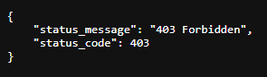
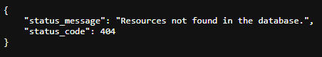
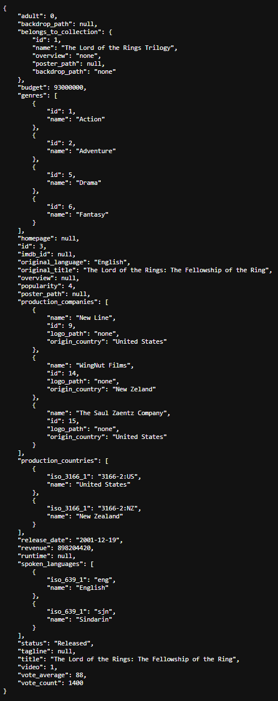

# MovieDb

REST API inspired by [The Movie Database API](https://www.themoviedb.org/documentation/api).

Build a relational database representing the data needed to reproduce a response made from The Movie Database API.
Perform data access through repositories and prepare responses with correct headers to send a JSON object.

Follow PSR-1, PSR-4 and PSR-12 recommendations.

### Technologies

- PHP 8.2
- Apache 2.4
- MySQL 8.0

### Resources

- REST : https://www.ics.uci.edu/~fielding/pubs/dissertation/rest_arch_style.htm
- Repository pattern : https://martinfowler.com/eaaCatalog/repository.html
- Response model : https://developers.themoviedb.org/3/movies/get-movie-details

### Visuals

*Database related to movies*


*Code 403*



*Code 404*



*Response*



## Installation

### Requirements

- PHP 8.2+
- Apache 2.4+
- MySQL 8.0+

### Manual installation

Clone the repository :

```bash
git clone https://github.com/kserbouty/moviedb.git
```

Switch to the repository folder :

```bash
cd moviedb
```

Install all the dependencies with composer :

```bash
composer install
```

Set database credentials in config/config.ini then import sql scripts (tables.sql first) available in docs/imports.

Run the local server :

```bash
php -S localhost:8000 -t public
```

Responses available :

- Akira : <http://localhost:8000/movie/1>
- Ghost in the Shell : <http://localhost:8000/movie/2>
- The Lord of the Rings: The Fellowship of the Ring : <http://localhost:8000/movie/3>
- The Lord of the Rings: The Two Towers : <http://localhost:8000/movie/4>
- The Lord of the Rings: The Return of the King : <http://localhost:8000/movie/5>

### Tests

Run PHPUnit :

```bash
vendor/bin/phpunit tests
```

## License

[MIT](./LICENSE.md)

## Project status

*Completed*
