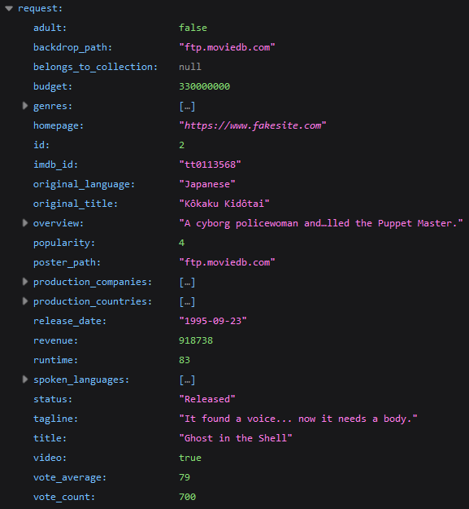
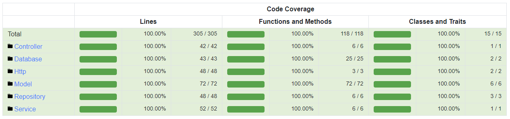

# MovieDb

REST API inspired by [The Movie Database API](<https://www.themoviedb.org/documentation/api>).

Reproduce the JSON response [Get Details](<https://developers.themoviedb.org/3/movies/get-movie-details>)
made from The Movie Database to be received by an external client. Handle data persistence with SQL and build
the response with the structure
provided by [The Movie Database API](<https://www.themoviedb.org/documentation/api>). 

### Technologies

- PHP 8.1
- MySQL 8.0
- Apache 2.4
- Composer 2.5
- PHPUnit 10.0

### Response



### Coverage



### Overview

- `/config` - Contains database configuration.
- `/docs` - Contains imports for SQL database.
- `/public` - Entry point with server configuration.
- `/src` - Contains all the classes.
- `/src/Controller` - Handle data needed by the router.
- `/src/Database` - Establish connection to the database.
- `/src/Http` - Handle responses with correct status.
- `/src/Model` - Entities of the application.
- `/src/Repository` - Handle data persistence.
- `/src/Service` - Handle the structure of a JSON response.
- `/tests` - Contains all the tests.

## Installation

### Requirements

- PHP 8.1+
- MySQL 8.0+
- Composer 2.5+

### Manual installation

Clone the repository :

```bash
git clone https://github.com/kserbouty/moviedb.git
```

Switch to the repository folder :

```bash
cd moviedb
```

Install all the dependencies with composer :

```bash
composer install
```

Set your database credentials in config/config.ini, then import the database available in docs/imports.

Run the local server :

```bash
php -S localhost:8000 -t public
```

Response available :

- Akira : <http://localhost:8000/movie/1>
- Ghost in the Shell : <http://localhost:8000/movie/2>
- The Lord of the Rings: The Fellowship of the Ring : <http://localhost:8000/movie/3>
- The Lord of the Rings: The Two Towers : <http://localhost:8000/movie/4>
- The Lord of the Rings: The Return of the King : <http://localhost:8000/movie/5>

### Tests

Run PHPUnit :

```bash
vendor/bin/phpunit
```

## License

[MIT](LICENSE.md)

## Project status

*Completed*
